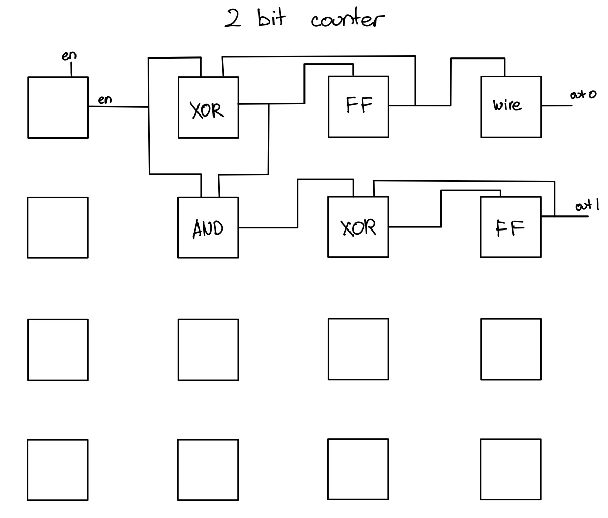
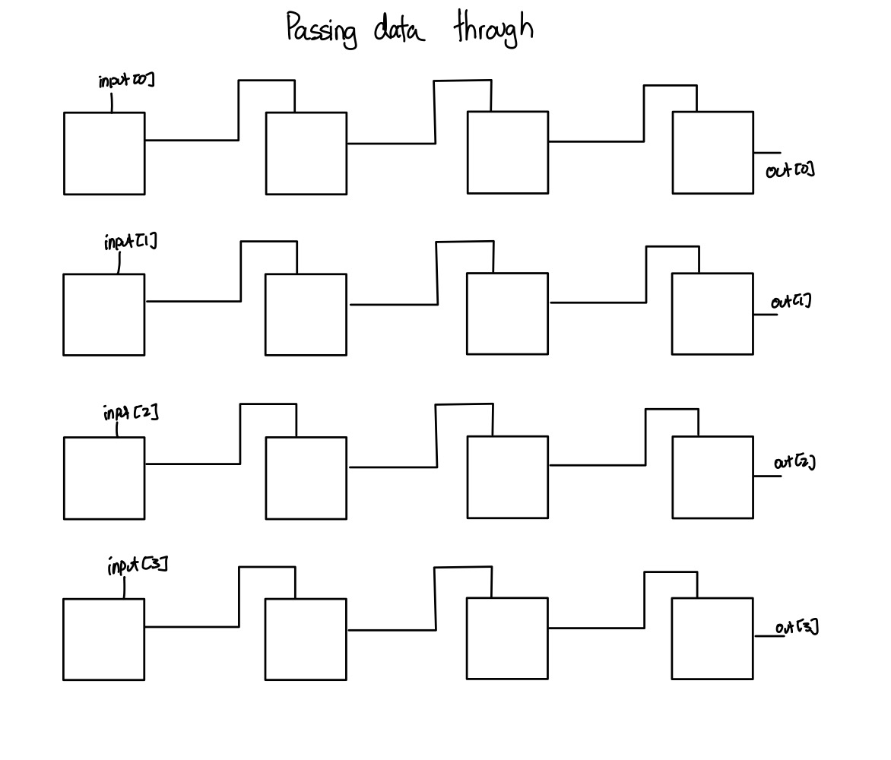
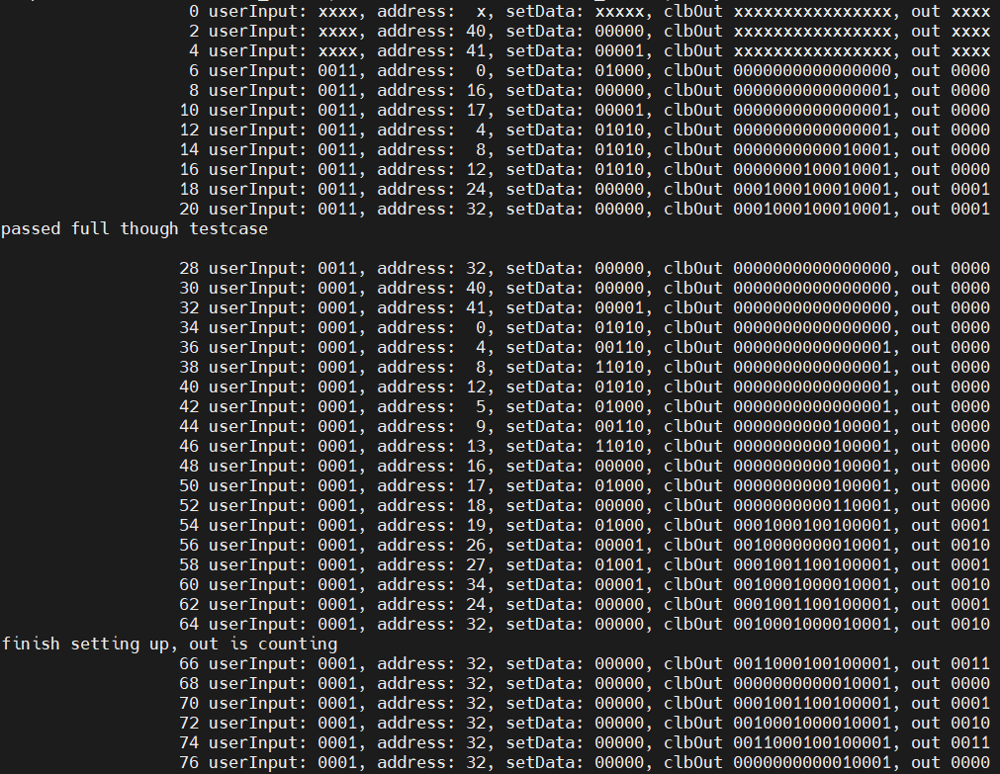

# TinyTapeout_FPGA

Yu-Ching Wu
18-224/624 Spring 2023 Final Tapeout Project

## Overview

A 4 by 4 basic FPGA. Can simulate up to 12 gates.

## How it Works

Each CLB block contains two switch box, one connecting to sel 0 in the LUT and the other connecting to sel 1 in the LUT. There is also the option of using the CLB block as register. It is possible for the CLB to be connected to any other CLB in the column before, current column, and the column after.

## Inputs/Outputs
| Input Number | Config | User Input|
| ---      | ---       | --- |
| 0 | SelReg | input [0] |
| 1 | LUT[0] | input [1] |
| 2 | LUT[1] | input [2] |
| 3 | LUT[2] | input [3] |
| 4 | LUT[3] | |
| 5 | Addr[0] | |
| 6 | Addr[1] | |
| 7 | Addr[2] | |
| 8 | Addr[3] | |
| 9 | Addr[4] | |
| 10 | Addr[5] | |
| 11 | Addr[6] | |

Output[3:0] will be connected to the last four clb of the FPGA.

## Hardware Peripherals
None

## Design Testing / Bringup
Write system verilog testbench. Two testcases, one to be able to pass values through all the modules, and the other to simulate a simply 2 bit counter.

Setting up and output of counter.

## Media

## (anything else)

If there is anything else you would like to document about your project such as background information, design space exploration, future ideas, verification details, references, etc etc. please add it here. This template is meant to be a guideline, not an exact format that you're required to follow.
